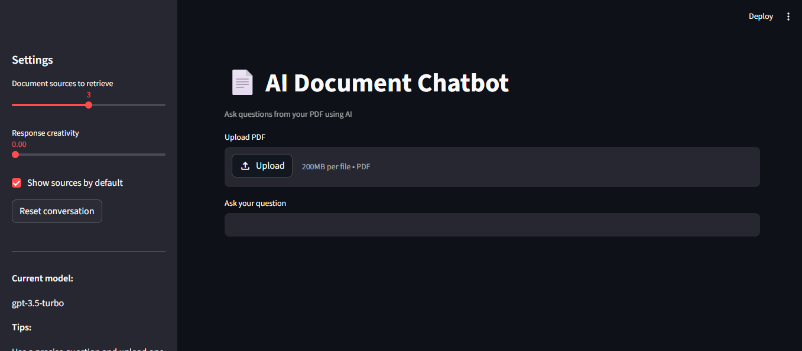

# AI Document Chatbot

## Problem
Businesses struggle to extract insights from large documents.

## Solution
This project builds an AI chatbot that allows users to upload PDFs and ask questions.

## Features
- PDF upload
- Question answering
- Source tracking
- Chat history

## Tech Stack
- Python
- Streamlit
- LangChain
- FAISS
- OpenAI API

## How to Run
pip install -r requirements.txt
streamlit run app.py

## Demo

## Future Improvements
- Multi-document support
- Local LLM integration